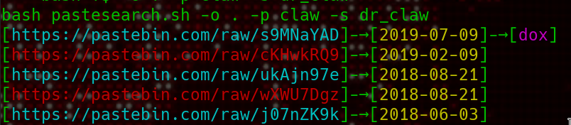

Pastesearch
============

Search on pastebin based on psdmp.ws api

### Usage:

usage:
======

```
   -s, --search [QUERY]         General search on pastebin
   -S, --searchv2 [QUERY]       Same as -s but with api v2
   -m, --mail  [EMAIL]          Search for emails 
   -d, --domain [DOMAIN]        Search specific domain
   -o, --save   [directory]     Save paste into directory
   -p, --prefix [prefix]        prefix when save paste
   -f, --firefox                Open paste in firefox (if result < 20)
```

- if paste exist it will be print in blue in the output
- if not paste will be print and red and will no be saved or open in firefox

 
